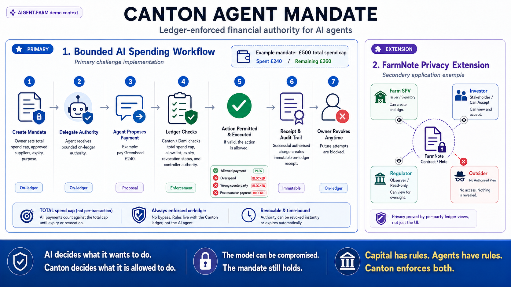
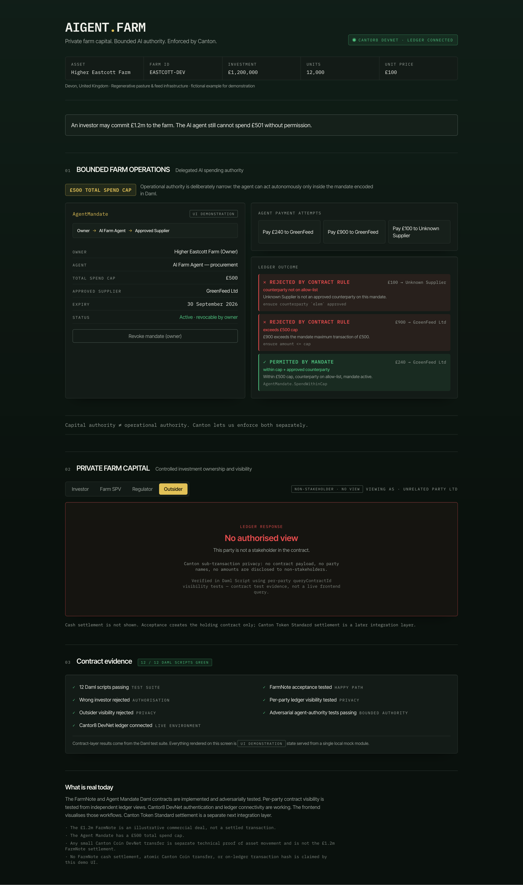
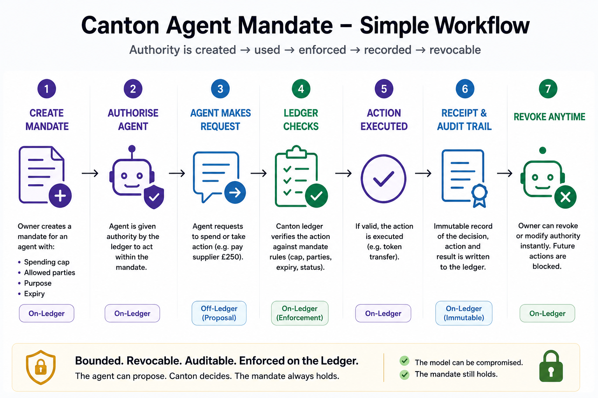
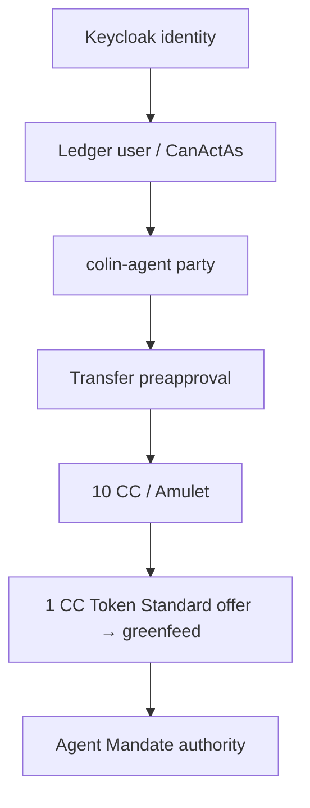

# Canton Agent Mandate

**Ledger-enforced financial authority for AI agents.**

We gave an AI agent money, then tried to make it misbehave.
The agent proposed payments.
Daml decided whether it had authority.
We then used a permitted decision to create a **real 1 CC Canton Token Standard
transfer offer** on Cantor8 DevNet.
The attacks were blocked.

> **The model can be compromised. The mandate still holds.**

*AIGENT.FARM* is the farm/application demo context. The submission is the
**Agent Mandate** (primary challenge); **FarmNote** is a privacy extension.



## The idea

**AI decides what it wants to do. Canton decides what it is allowed to do.**

Threat model: **assume the agent may fail or be compromised. Constrain what it
can actually do.** Enforcement is **not in the UI, not in Python, not in the
model prompt — in Daml on the ledger.**

## Primary challenge — Agent Mandate

A farm owner delegates bounded financial authority to an AI procurement agent.
The Daml mandate enforces: owner, agent, a **£500 total mandate spend cap (not a
per-transaction cap)**, cumulative spend, an approved-counterparty allow-list,
expiry, owner-controlled revocation, and authorised charge receipts.

Attack matrix:

```text
Allowed payment           PASS
Overspend attack          BLOCKED
Wrong counterparty        BLOCKED
Post-revocation payment   BLOCKED
```

Commercial examples:

```text
£240 → GreenFeed Ltd       PERMITTED
£900 → GreenFeed Ltd       REJECTED — TOTAL SPEND CAP
£100 → Unknown Supplier    REJECTED — COUNTERPARTY
after owner revokes        REJECTED — MANDATE REVOKED
```

After the £240 example:

```text
Spent: £240
Remaining mandate authority: £260
```



## How it works

```text
AI payment request
        ↓
Daml Agent Mandate
        ↓
PERMITTED / REJECTED
        ↓
only if permitted
        ↓
Canton Token Standard transfer
```

Two separate steps — **Daml authorisation**, then **Token Standard settlement** —
**not atomic** in this implementation. Rejected requests never invoke settlement.



## Real Daml evidence

**12 / 12 Daml scripts green.** Each line is a real script; the `submitMustFail`
guards mean the suite passes only if the ledger *rejects* each prohibited action.

```text
daml/Adversarial.daml:setup: ok
daml/Adversarial.daml:agentCannotRevoke: ok
daml/Adversarial.daml:strangerCannotCharge: ok
daml/Adversarial.daml:ownerCannotCharge: ok
daml/Adversarial.daml:adjustDoesNotWidenAllowList: ok
daml/Adversarial.daml:emptyAllowListBlocksAll: ok
daml/Demo.daml:demo: ok
daml/FarmNoteTest.daml:testWrongInvestorCannotAccept: ok
daml/FarmNoteTest.daml:testFarmNoteAccept: ok
daml/FarmNoteTest.daml:testFarmNotePrivacy: ok
daml/Test.daml:testMandate: ok
daml/Test.daml:testExpiry: ok
```

If one of those prohibited actions succeeds, the test suite goes red.

Authorised charges create a `ChargeReceipt` recording payee/counterparty, amount,
memo, cumulative spend, cap-at-charge, timestamp, and authorisation reason.
Rejected submissions create **no** successful receipt — they are demonstrated
through ledger rejection and the adversarial tests.

## Real Cantor8 DevNet evidence

Newest verified state (this supersedes any earlier "settlement not attempted"
wording): a real Token Standard transfer **offer** now exists.

```text
Mandate decision:    PERMITTED
Commercial request:  £240 → GreenFeed
Technical proof:     1 CC
Sender:              colin-agent
Receiver:            greenfeed
Before spendable:    10 CC
After spendable:     9 CC
Locked in offer:     1 CC
transferKind:        offer
Status:              OFFER CREATED
Receiver acceptance: PENDING
```

**£240 ≠ 1 CC.** The £240 is the commercial request that demonstrates mandate
authorisation; the **1 CC** is a separate Token Standard settlement *proof*. The
1 CC is **locked in a real transfer offer**; **final receiver acceptance is
pending** — the accept path hit a registry choice-context 404, documented (not
hidden) in [docs/devnet/TROUBLESHOOTING.md](docs/devnet/TROUBLESHOOTING.md).



Full engineering record: **[docs/devnet/](docs/devnet/README.md)**.

## FarmNote — privacy extension

Not the primary challenge; a Canton-native privacy/application extension.

```text
Farm SPV      issuer / signatory
Investor      stakeholder / can accept
Regulator     observer / read-only
Outsider      no authorised view
```

Fields: issuer, investor/owner, regulator, farmId, units, unitPrice. Privacy is
tested with independent per-party `queryContractId` views — the outsider receives
no FarmNote contract view.

> **The privacy difference isn't CSS. The tests query the ledger independently as
> each participant.**

The illustrative £1.2m FarmNote is **not settled capital**.

> An investor may commit £1.2m to the farm. The AI agent still cannot spend £501
> without permission. Capital authority ≠ operational authority.

## What is real / what is not claimed

**Real:** working Daml Agent Mandate; ledger-enforced spend cap, allow-list,
expiry, owner revocation; authorised receipts; **12/12 Daml scripts green**;
adversarial attack tests; FarmNote private workflow; per-party visibility tests;
Cantor8 DevNet authentication; CanActAs / party authority; real **10 CC** funding;
real Amulet holdings; real `greenfeed` party; real **1 CC Token Standard transfer
offer**; real **10 → 9** spendable CC transition; real **1 CC locked** in the offer.

**Not claimed:** final GreenFeed receipt of the 1 CC; atomic Daml authorisation +
Token Standard settlement; a settled £1.2m FarmNote; £240 = 1 CC; fake
transaction hashes; fake live FarmNote frontend state.

## Run it

Daml (in-memory, ~1s, no network):

```bash
daml build
daml test
```

UI:

```bash
cd ui
npm install
npm run dev        # npm run build for production
```

Cantor8 DevNet preflight:

```bash
source .env
python3 adapter/doctor.py
```

## Deeper docs

- **[Hackathon deck](docs/Canton-Agent-Mandate-Hackathon-Deck.pptx)** — the presentation (PowerPoint)
- **[DEVNET.md](DEVNET.md)** · **[docs/devnet/](docs/devnet/README.md)** — network, parties, integration
- **[docs/devnet/AUTH-AND-PARTIES.md](docs/devnet/AUTH-AND-PARTIES.md)** · **[TOKEN-TRANSFERS.md](docs/devnet/TOKEN-TRANSFERS.md)** · **[TROUBLESHOOTING.md](docs/devnet/TROUBLESHOOTING.md)** · **[LESSONS-LEARNED.md](docs/devnet/LESSONS-LEARNED.md)**
- **[ARCHITECTURE.md](ARCHITECTURE.md)** — control planes and the identity chain
- **[DEMO.md](DEMO.md)** — 60–90 second judge walkthrough

## Closing

**AI decides what it wants to do. Canton decides what it is allowed to do.**

**The model can be compromised. The mandate still holds.**

---

*AIGENT.FARM: capital has rules. Agents have rules. Canton enforces both.*
